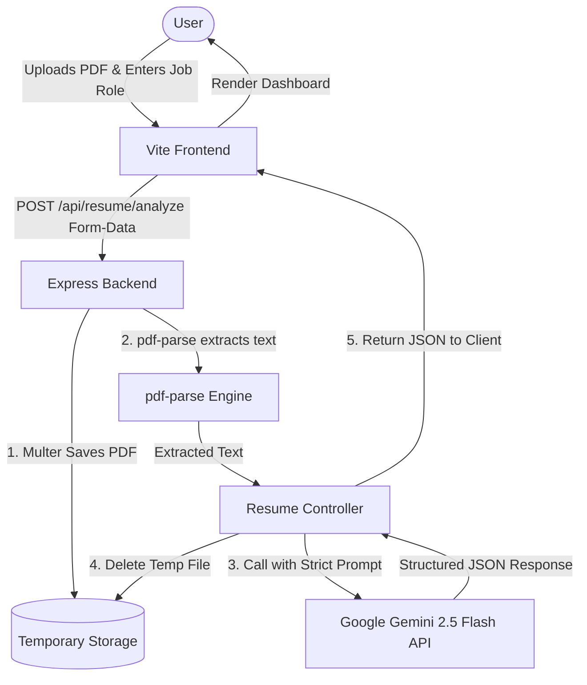

# 🤖 AI Resume Analyzer

An intelligent, full-stack web application that acts as a strict **Applicant Tracking System (ATS) Resume Analyzer**. The application extracts text from uploaded PDF resumes, processes the content, and leverages Google's Gemini 2.5 Flash API to analyze the resume against industry standards or specific job descriptions. It provides a visual score, detailed strengths and weaknesses, missing skills, and an actionable improvement plan.

---

## 🎯 Features

*   **⚡ PDF Text Extraction:** Extracts text dynamically from uploaded PDF resumes using a robust parsing pipeline.
*   **🧠 Gemini AI Powered Analysis:** Evaluates resumes using Google Gemini 2.5 Flash, providing deterministic scoring and deep insights.
*   **📊 Precise ATS Scoring:** Evaluates resumes on a strict `0 - 99` score scale based on predefined rubrics:
    *   **Skills:** 30 pts
    *   **Experience:** 25 pts
    *   **Projects:** 20 pts
    *   **Structure:** 15 pts
    *   **ATS Keywords:** 10 pts
*   **🔍 Detailed Breakdown:**
    *   ✅ **Strengths:** Highlight what the candidate did well.
    *   ⚠️ **Weak Areas:** Constructive feedback on sections needing attention.
    *   🧠 **Missing Skills:** Key technical/domain skills missing relative to the target role.
    *   🚀 **Actionable Suggestions:** A step-by-step roadmap to boost the resume's ATS performance.
*   **📱 Modern, Glassmorphic UI:** A premium dark-themed interface built using React, Vite, and Tailwind CSS v4, complete with smooth loading animations, progress indicators, and interactive cards.
*   **📄 Real-time Document Preview:** View your uploaded PDF directly inside the browser alongside the AI analysis for easy cross-referencing.

---

## 🏗️ Architecture & Workflow



---

## 🛠️ Tech Stack

### Frontend
*   **Core:** React 19, Vite
*   **Styling:** Tailwind CSS v4 (incorporating glassmorphic styles and custom gradients)
*   **Routing:** React Router v7
*   **Icons:** Lucide React
*   **Animations:** Lottie React, CSS custom micro-animations

### Backend
*   **Runtime:** Node.js
*   **Framework:** Express.js
*   **File Uploads:** Multer
*   **Text Extraction:** pdf-parse
*   **AI Integration:** Native Fetch request to the Google Gemini API (v1beta)

---

## 📁 Repository Structure

```text
AI Resume Analyzer/
├── backend/                  # Node.js + Express backend server
│   ├── src/
│   │   ├── controllers/      # Request handlers (AI analysis, upload handling)
│   │   ├── middlewares/      # Multer file upload configuration
│   │   ├── routes/           # REST endpoints
│   │   ├── services/         # PDF Parsing & Gemini API integration services
│   │   └── uploads/          # Temporary directory for uploaded PDFs
│   ├── app.js                # Express app configuration
│   ├── server.js             # Server startup script
│   └── package.json          # Dependencies & scripts
│
└── client/                   # Vite + React frontend client
    ├── src/
    │   ├── assets/           # Lottie animations and images
    │   ├── components/       # Reusable components (Navbar, Upload, Scan, Review)
    │   ├── pages/            # Page layouts (Home page)
    │   ├── App.jsx           # Main routing & application wrapper
    │   └── index.css         # Tailwind directives & global styling variables
    ├── index.html            # Main entry point
    └── package.json          # Dependencies & scripts
```

---

## 🚀 Getting Started

### Prerequisites
Make sure you have [Node.js](https://nodejs.org/) installed (v18+ recommended) along with `npm`.

---

### 1. Backend Setup

1. Navigate to the `backend` folder:
   ```bash
   cd backend
   ```

2. Install dependencies:
   ```bash
   npm install
   ```

3. Create a `.env` file in the root of the `backend` folder and add your environment variables:
   ```env
   PORT=3000
   GEMINI_API_KEY=your_gemini_api_key_here
   ```

4. Start the development server:
   ```bash
   # Using nodemon (if installed globally/locally as dev dependency)
   npm run start
   ```

The backend server will run at `http://localhost:3000`.

---

### 2. Frontend Setup

1. Navigate to the `client` folder:
   ```bash
   cd ../client
   ```

2. Install dependencies:
   ```bash
   npm install
   ```

3. Create a `.env` file in the root of the `client` folder:
   ```env
   VITE_BACKEND_URL=http://localhost:3000/
   ```

4. Run the frontend application:
   ```bash
   npm run dev
   ```

The client will open in your browser, typically at `http://localhost:5173`.

---

## 🔌 API Endpoints

### Post Resume for Analysis

*   **Endpoint:** `POST /api/resume/analyze`
*   **Content-Type:** `multipart/form-data`
*   **Request Body:**
    *   `resume` (File, required): The PDF copy of the resume.
*   **Response Format (JSON):**
    ```json
    {
      "success": true,
      "analysis": {
        "atsScore": 78,
        "strengths": [
          "Strong experience section with quantitative metrics.",
          "Clear structural layout."
        ],
        "weaknesses": [
          "Lack of projects showcasing Tailwind CSS v4."
        ],
        "missingSkills": [
          "TypeScript",
          "Docker"
        ],
        "suggestions": [
          "Add 1-2 major full-stack projects to your resume.",
          "Incorporate missing ATS keywords like Docker and CI/CD."
        ]
      }
    }
    ```

---

## 📝 License

This project is licensed under the **ISC License**.
